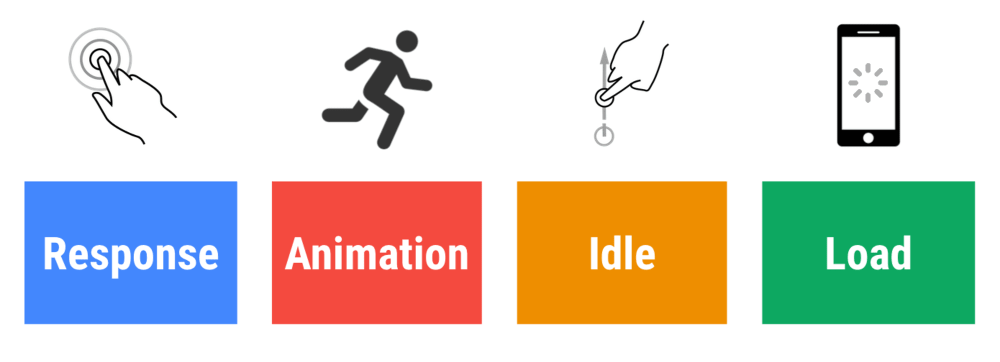

RAIL是一个性能评估模型，将影响应用性能表现的许多因素总结为四个方面：

## RAIL

* Response

  在100ms内响应用户输入。
* Animation

  在10ms内生成动画的一帧。每秒60帧的动画用户就会感到流畅，理论上来说16ms内（1000ms/60fps）生成即可，但需要留一定的时间给浏览器渲染。
* Idle

  最大化空闲时间。不要长时间占用浏览器的主线程，否则会导致用户与页面发生交互时无法及时响应,一次任务的执行时间最好在50ms内。例如：React在提出Fiber架构之前，如果一次渲染任务耗时较长，在此期间用户的输入动作将得不到任何反馈。
* Load

  在2s内完成页面加载，在5s内提供可交互内容。

## 采集

哪些工具可以采集RAIL模型数据:

* Chrome DevTools-Performance
* Lighthouse(Chrome DevTools-Audits)
* [PageSpeed Insights](https://developers.google.com/speed/pagespeed/insights/)
* [WebPageTest](https://webpagetest.org/easy)

---
参考：

[Measure Performance with the RAIL Model](https://developers.google.com/web/fundamentals/performance/rail)
